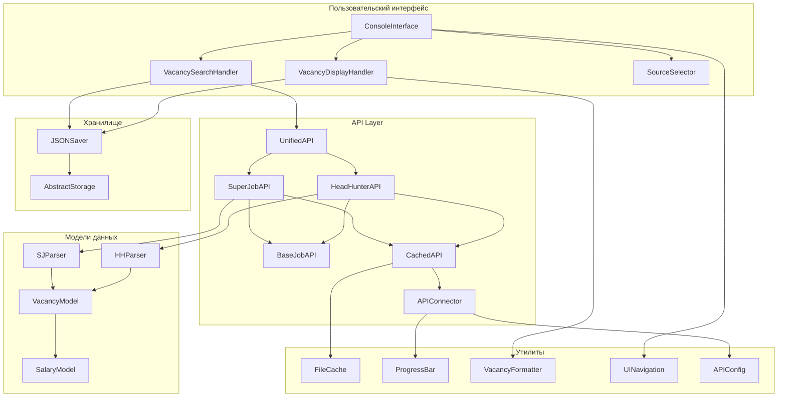

# Диаграмма взаимодействия модулей Project02

## Общая архитектура



## Детальное взаимодействие классов

### 1. Слой пользовательского интерфейса

```
ConsoleInterface
    ├── run() -> main_menu_loop
    ├── _search_vacancies() -> VacancySearchHandler.search_vacancies()
    ├── _show_saved_vacancies() -> VacancyDisplayHandler.show_all_saved_vacancies()
    └── _advanced_search() -> VacancyDisplayHandler.advanced_search()

VacancySearchHandler
    ├── search_vacancies() -> SourceSelector.select_sources()
    ├── _handle_search_results() -> VacancyFormatter.format_vacancy_info()
    └── _save_vacancies() -> JSONSaver.add_vacancy()

VacancyDisplayHandler
    ├── show_all_saved_vacancies() -> JSONSaver.load_vacancies()
    ├── show_top_vacancies_by_salary() -> vacancy_operations.get_top_by_salary()
    └── search_saved_vacancies_by_keyword() -> ui_helpers.filter_vacancies_by_keyword()
```

### 2. Слой API

```
UnifiedAPI
    ├── get_vacancies_from_sources()
    │   ├── HeadHunterAPI.get_vacancies_with_deduplication()
    │   └── SuperJobAPI.get_vacancies_with_deduplication()
    ├── _deduplicate_cross_platform()
    └── clear_cache() -> {HH|SJ}API.clear_cache()

HeadHunterAPI (extends CachedAPI, BaseJobAPI)
    ├── get_vacancies() -> get_vacancies_page() -> APIConnector.connect()
    ├── _validate_vacancy() -> check required fields
    └── _deduplicate_vacancies() -> BaseJobAPI._create_dedup_key()

SuperJobAPI (extends CachedAPI, BaseJobAPI)
    ├── get_vacancies() -> get_vacancies_page() -> APIConnector.connect()
    ├── _validate_vacancy() -> check required fields
    └── _deduplicate_vacancies() -> BaseJobAPI._create_dedup_key()
```

### 3. Система кэширования

```
CachedAPI
    ├── __connect_to_api()
    │   ├── _cached_api_request() -> memory cache (TTL 5 min)
    │   ├── FileCache.load_response() -> disk cache
    │   └── APIConnector.connect() -> real API call
    └── clear_cache() -> FileCache.clear() + memory cache clear

FileCache
    ├── save_response() -> JSON file in data/cache/
    ├── load_response() -> read from JSON + check TTL
    └── clear() -> remove cache files
```

### 4. Модели и парсеры

```
Vacancy (основная модель)
    ├── from_dict() -> parse various formats
    ├── to_dict() -> serialize for storage
    └── __init__() -> validate and normalize data

HHParser
    ├── parse_vacancies() -> List[HHVacancy]
    └── convert_to_unified_format() -> Vacancy compatible dict

SJParser
    ├── parse_vacancies() -> List[SJVacancy]
    └── convert_to_unified_format() -> Vacancy compatible dict

SalaryModel
    ├── __init__() -> normalize currency and amounts
    ├── __str__() -> format for display
    └── __lt__(), __gt__() -> comparison operators
```

### 5. Хранилище данных

```
JSONSaver (implements AbstractStorage)
    ├── add_vacancy() -> validate + deduplicate + save
    ├── load_vacancies() -> read + parse + create Vacancy objects
    ├── delete_vacancy_by_id() -> filter + save
    └── _save_to_file() -> atomic write with validation

AbstractStorage
    ├── add_vacancy() -> abstract method
    ├── get_vacancies() -> abstract method
    └── delete_vacancy() -> abstract method
```

## Потоки данных

### Поиск новых вакансий
```
1. User input -> ConsoleInterface
2. ConsoleInterface -> VacancySearchHandler.search_vacancies()
3. VacancySearchHandler -> SourceSelector.select_sources()
4. VacancySearchHandler -> UnifiedAPI.get_vacancies_from_sources()
5. UnifiedAPI -> {HH|SJ}API.get_vacancies_with_deduplication()
6. {HH|SJ}API -> CachedAPI.__connect_to_api()
7. CachedAPI -> APIConnector.connect() (если нет в кэше)
8. API response -> {HH|SJ}Parser.parse_vacancies()
9. Parsed data -> Vacancy.from_dict()
10. Vacancy objects -> VacancySearchHandler._save_vacancies()
11. VacancySearchHandler -> JSONSaver.add_vacancy()
```

### Просмотр сохраненных вакансий
```
1. User input -> ConsoleInterface
2. ConsoleInterface -> VacancyDisplayHandler.show_all_saved_vacancies()
3. VacancyDisplayHandler -> JSONSaver.load_vacancies()
4. JSONSaver -> Vacancy.from_dict() for each stored vacancy
5. Vacancy list -> VacancyFormatter.format_vacancy_info()
6. Formatted data -> UINavigation.quick_paginate()
7. Paginated display -> User
```

### Кэширование API запросов
```
1. API request -> CachedAPI.__connect_to_api()
2. Check memory cache (simple_cache decorator)
3. If miss -> Check FileCache.load_response()
4. If miss -> APIConnector.connect() to real API
5. Store in FileCache.save_response()
6. Return cached/fresh data
```

## Принципы взаимодействия

### 1. Инверсия зависимостей
- Высокоуровневые модули не зависят от низкоуровневых
- Использование абстрактных базовых классов
- Dependency injection через конструкторы

### 2. Единственная ответственность
- Каждый класс имеет одну причину для изменения
- Четкое разделение между UI, бизнес-логикой и данными

### 3. Открыт/Закрыт принцип
- Легко добавить новые источники API через наследование
- Расширяемая система парсеров и форматтеров

### 4. Композиция над наследованием
- UnifiedAPI использует композицию для объединения API
- Модульная система утилит и хелперов
